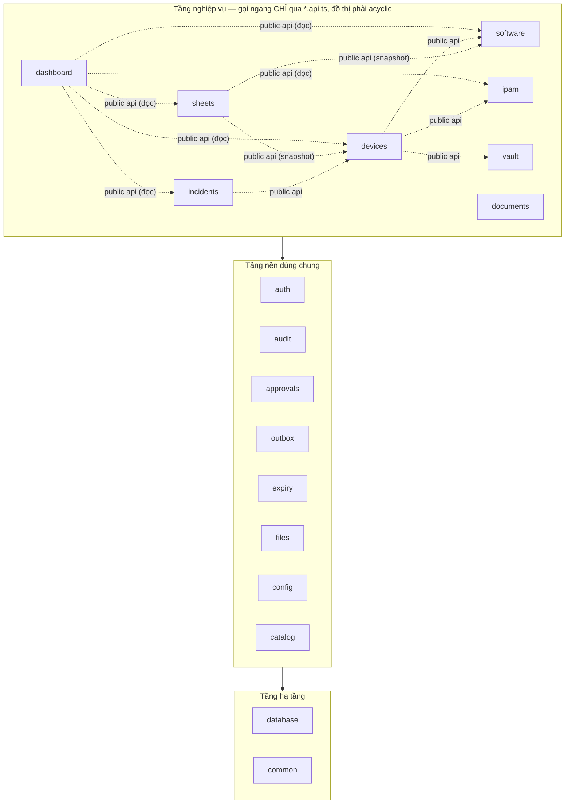

# Architecture Spine — IMS

## Design Paradigm

**Modular monolith** (NestJS): mỗi nghiệp vụ = một module; trong module đi một chiều `controller → service → DB`; service tách `*-read.service.ts` / `*-write.service.ts`. Ranh giới giữa các module nghiệp vụ = **public api service** (AD-2). Data access = **drizzle-orm** (nếp thật của QLTS — ratify, không cải tạo). Frontend React SPA (Vite) gọi REST; UI nền tảng từ `web/ui` QLTS.

## Invariants & Rules

### AD-1 — Modular monolith, layered một chiều, drizzle-orm `[ADOPTED]`

- **Binds:** all
- **Prevents:** mỗi module một kiểu kiến trúc; hai lớp data-access song song (drizzle của code copy + raw SQL viết mới).
- **Rule:** một nghiệp vụ = một NestJS module; trong module chỉ đi `controller → service → DB`; đọc/ghi tách read/write service. Data access thống nhất **drizzle-orm** (như code QLTS copy sang); schema drizzle đặt tại module chủ bảng.

### AD-2 — Ranh giới module = public api service; đồ thị acyclic, enforce bằng CI

- **Binds:** all
- **Prevents:** vòng phụ thuộc kiểu `assets-write→software-license→assets.service` của QLTS; SQL lậu xuyên module.
- **Rule:** mỗi module nghiệp vụ export đúng **một** `*.api.ts` (public api service) qua module exports. Module nghiệp vụ được inject public api của module khác để **đọc/ghi chéo** — cấm import bất kỳ file nội bộ nào của module khác, cấm SQL/JOIN đụng bảng module khác. Đồ thị phụ thuộc giữa các module nghiệp vụ **phải acyclic** — enforce bằng `dependency-cruiser` chạy trong CI, không chỉ review. Tầng nền không import tầng nghiệp vụ.

### AD-3 — Mỗi bảng một chủ; mọi truy cập chéo qua public api của chủ

- **Binds:** all
- **Prevents:** hai module cùng ghi một bảng; "chỉ đọc" biến thành SELECT lậu.
- **Rule:** chủ bảng duy nhất — `devices`: device, port_map · `software`: software, license_assignment, renewal_history · `ipam`: subnet, ip_address, ip_history, nat_rule · `vault`: secret, access_list, access_grant · `sheets`: sheet_template, sheet_period, sheet_entry · `incidents`: incident · `approvals`: approval · `audit`: audit_log (ghi qua interceptor) · `auth`: user, session · `catalog`: site, cabinet, device_type, vendor · `config`: system_config · `files`: file · `outbox`: outbox · `expiry`: expiry_rule. Module khác không đụng bảng — đọc lẫn ghi đều qua public api của module chủ (vd: devices gọi `ipam.api.assignIp(deviceId, ...)`). FR-005 (trang thiết bị tổng hợp) và FR-027 (dashboard) compose bằng public api, không SQL chéo.

### AD-4 — Bảng secret là lãnh địa cấm

- **Binds:** FR-021..026, FR-036, NFR-02
- **Prevents:** module khác chạm ciphertext/plaintext ngoài đường audit.
- **Rule:** bảng `secret` không xuất hiện trong bất kỳ query nào ngoài module `vault`; public api của vault không bao giờ trả plaintext trừ đúng luồng xem đã step-up TOTP (FR-022/023), mỗi lần giải mã = một dòng audit. TOTP secret của user cũng đi cơ chế envelope này. Vault **không đăng ký** gì vào expiry engine.

### AD-5 — Một request ghi = một transaction, tx truyền tường minh

- **Binds:** all endpoints ghi
- **Prevents:** nghiệp vụ commit nhưng audit/mail rơi mất khi crash; mỗi nơi một kiểu truyền transaction.
- **Rule:** nghiệp vụ + dòng audit + outbox message commit chung hoặc rollback chung trong `db.transaction()` (drizzle). Transaction **truyền tường minh làm tham số** (`tx`) xuống mọi hàm ghi — không AsyncLocalStorage, không connection ngầm. Không gửi mail trực tiếp trong request — mọi email đi qua outbox.

### AD-6 — Một module `approvals` cho mọi luồng duyệt; hiệu lực = expires_at

- **Binds:** FR-023 (break-glass), FR-033 (phiếu), incidents
- **Prevents:** mỗi tính năng tự chế bảng duyệt; grant break-glass "sống mãi" vì không ai đóng.
- **Rule:** mọi luồng xin–duyệt dùng bảng `approval` chung + từ vựng state đăng ký theo loại; state đổi qua `transition()` khai báo, cấm UPDATE status tự do. Grant break-glass mang `expires_at`; **hiệu lực kiểm tại mỗi lần đọc bằng `expires_at > now()`** — không tin status; sweep dọn grant hết hạn chỉ để vệ sinh. Notify duyệt qua outbox email.

### AD-7 — Expiry engine nhận provider, không quét bảng ai

- **Binds:** FR-012..014
- **Prevents:** engine SELECT bảng module khác (phạm AD-3), hoặc quét nhầm bảng secret (phạm AD-4).
- **Rule:** module nghiệp vụ đăng ký **`ExpirySource` provider** (callback trả `{id, label, loại, start, end, link}`); engine chỉ gọi provider + áp luật digest (loại + cửa sổ ngày + người nhận + tần suất, lưu `system_config`) và đẩy email qua outbox. Thao tác "đã gia hạn" (FR-014) gọi public api của module chủ (vd `software.api.renew(...)`) — engine không ghi bảng ai.

### AD-8 — Auth tự xây theo 5 tường `[ADOPTED]`

- **Binds:** NFR-01, NFR-02
- **Prevents:** lệch khỏi thiết kế đã thẩm định chuyên gia (PRD §4–5, addendum §2–3); hai cơ chế CSRF chồng nhau.
- **Rule:** Argon2id + pepper (`@node-rs/argon2` 2.x); TOTP `otplib` 13.x + chống replay (last_used_timestep); session server-side Postgres (kế thừa bảng sessions QLTS, bỏ cột OIDC). CSRF dùng **cơ chế `csrf_token` thừa kế trong bảng sessions QLTS** + kiểm tra header Origin — không thêm thư viện csrf-csrf. Vault AES-256-GCM envelope, AAD = `record_id + key_version + table`, master key qua docker secret file. Không OIDC/IdP, không JWT client-side.

### AD-9 — Mọi endpoint ghi qua `@Audited`, quyền mặc định đóng `[ADOPTED]`

- **Binds:** all controllers
- **Prevents:** endpoint quên audit hoặc quên phân quyền lọt ra production.
- **Rule:** endpoint ghi thiếu `@Audited` = review chặn; controller không khai `@Roles(...)` = 401 (default-secure). Bảng audit append-only (REVOKE UPDATE/DELETE tầng DB role). **Từ 20/09/2026 câu đó mới ĐÚNG với thực tế đang chạy:** trước đó ứng dụng kết nối bằng `ims` — vừa superuser vừa chủ sở hữu — nên REVOKE của `0005` không có hiệu lực nào và chủ sở hữu còn tháo được cả trigger. `0048_app_role_split.sql` tách role `ims_app` (migration chạy bằng chủ sở hữu, ứng dụng chạy bằng role hẹp), và `assertNarrowRole` trong `main.ts` chặn boot ở production nếu `.env` chưa đổi.

### AD-10 — Migration chỉ tiến, seed danh mục là migration

- **Binds:** database
- **Prevents:** sửa lịch sử migration → drift; danh mục cài tay mỗi máy một khác.
- **Rule:** bộ migration mới từ `0000`, đánh số 4 chữ số theo thứ tự merge, chạy qua `migration-runner` QLTS (advisory lock + checksum); không sửa file đã chạy. Seed danh mục (site, tủ, loại thiết bị, vendor, 5 template phiếu nhóm A) là migration đánh số; dữ liệu thật đi đường import Excel (FR-003).

### AD-11 — Cấu hình 2 tầng, cấm hardcode

- **Binds:** all
- **Prevents:** hằng số nghiệp vụ chôn trong code, đổi phải deploy.
- **Rule:** bí mật (master key, pepper, SMTP pass) = docker secret file, không env, không DB. Tham số vận hành (mốc digest, trần 24h, N giây ẩn, ngưỡng lockout) = bảng `system_config`, chỉnh qua UI Admin. Không hằng số nghiệp vụ nào hardcode.

### AD-12 — Repo trắng, copy module QLTS theo bản đồ `[ADOPTED]`

- **Binds:** all
- **Prevents:** fork mang theo rác booking/OIDC; "tận dụng tạm" code auth cũ nửa vời.
- **Rule:** khởi tạo repo mới; copy nguyên: `database/migration-runner`, `audit/`, `outbox/`+`queue/`, `config/`, `files/`, mail hạ tầng, `web/ui`+`web/lib`, docker skeleton. Bỏ: booking/pool, toàn bộ OIDC, directory-sync, chatbot. Khi copy: tách type `AuthedRequest` ra `auth/types.ts`; viết lại `SessionAuthService` bỏ OIDC-refresh; grep quét `PMH_|oidc|openid|login_hint|booking`; `crypto-secret.ts` cũ chỉ dùng cho SMTP. **Version theo code copy: giữ `bullmq` ^5 như QLTS** — không nâng major khi copy.

### AD-13 — Lịch sử nghiệp vụ = bảng history append-only của module chủ

- **Binds:** FR-007, FR-014, FR-018, FR-025
- **Prevents:** nơi render lịch sử từ audit_log, nơi từ bảng riêng — hai nguồn sự thật.
- **Rule:** lịch sử nghiệp vụ hiển thị cho user (lịch sử IP, lần gia hạn, gán license, grant break-glass) = bảng history append-only thuộc module chủ (pattern `allocation_history` QLTS). `audit_log` chỉ phục vụ an ninh/truy vết, không là nguồn render nghiệp vụ.

### AD-14 — Port map: một kết nối = một bản ghi; phiếu autofill = snapshot

- **Binds:** FR-006, FR-029
- **Prevents:** hai trang thiết bị ghi hai bản ghi đối xứng cho cùng sợi dây; phiếu ISO đổi nội dung theo dữ liệu sống sau khi đã chốt kỳ.
- **Rule:** `port_map` = một bản ghi/kết nối `(device_id, port_label, connected_device_id?, note, người dùng)` — hiển thị hai chiều bằng query, không tạo bản ghi đối xứng. Field tự điền trên phiếu (tên job, server…) **snapshot tại thời điểm sinh kỳ** — phiếu là bằng chứng thời điểm, không cập nhật theo dữ liệu sống.

### AD-15 — Dùng chung viết một lần, có nhà cố định và có sổ đăng ký

- **Binds:** toàn bộ UI, FR-028, FR-012..014, FR-022, FR-029, AD-13
- **Prevents:** mỗi màn tự chế popup confirm / dialog / chọn lịch; `ExcelExportService` viết ở Epic 2 rồi viết lại ở Epic 7; badge "sắp hết hạn" mỗi nơi tính một kiểu; sửa một hành vi phải đi sửa 9 chỗ.
- **Rule:** thứ nào dùng ở **≥2 màn hoặc ≥2 module** là tài sản dùng chung — đặt tại `web/src/ui` (UI + hook) hoặc `src/common` + module nền (API), **không** nằm trong `features/` hay module nghiệp vụ. Story sinh ra nó phải khai ngay vào `docs/SHARED-REGISTRY.md` (tên · đường dẫn · dùng ở đâu · khi nào KHÔNG dùng). Story sau **bắt buộc đọc registry trước khi viết mới**; cần khác biệt thì mở rộng bằng prop/tham số/provider, **cấm fork bản sao**. Cụ thể cấm: `window.confirm`/`window.alert`, dialog tự dựng trong `features/`, hex màu ngoài `tokens.css`, tự viết logic phân trang / export xlsx / tính trạng thái hạn. Enforce bằng eslint (`no-restricted-syntax`, `no-restricted-imports`) trong CI, cùng chỗ với `dependency-cruiser` của AD-2 — không chỉ trông vào review.

### AD-16 — Tên định danh trong mã phải là tiếng Anh

- **Binds:** toàn bộ `api/src`, `api/test`, `web/src`, `e2e` — mã sản phẩm và mã kiểm như nhau
- **Prevents:** một cơ sở mã hai ngôn ngữ, nơi `soLuong` và `quantity` cùng tồn tại và không ai biết cái nào là thật; `git grep` tìm một khái niệm phải đoán người viết nghĩ bằng tiếng gì; và cái giá lớn nhất — mỗi định danh tiếng Việt mới sinh ra làm đợt đổi tên sau đó đắt thêm, nên nợ tự nuôi chính nó. Đo 19/09: **237 định danh + 15 tên tệp**, không cổng nào chặn cái mới.
- **Rule:** định danh (biến, hàm, lớp, hằng, thuộc tính, tên tệp) viết bằng **tiếng Anh**. Tiếng Việt chỉ được ở ba nơi: **chú thích**, **mô tả bài kiểm** (`describe`/`it`/`test`), và **bảng ánh xạ nhãn nhập-Excel** (`devices/device-import.ts`, `catalog/catalog-import.ts`) — ở đó chuỗi tiếng Việt là DỮ LIỆU người dùng gõ vào tệp, đổi là hỏng chức năng nhập. Chuỗi hiển thị cho người dùng đi qua `lib/i18n` (DoD gạch 6), không phải ngoại lệ của luật này.
- **Enforce:** `no-restricted-syntax` với selector `Identifier[name=/[À-ỹ]/]` trong cả ba cấu hình eslint (api · web · e2e), cùng chỗ với AD-2/AD-15. **Lớp này chỉ bắt định danh CÓ DẤU**; tiếng Việt không dấu (`soLuong`, `ghi`, `truoc`) cần một từ điển âm tiết — đó là lớp hai, làm cùng đợt đổi tên (mục 3.4 của `docs/RA-SOAT-TOAN-DIEN-2026-09-19.md`).
- **Cổng phải có bài canh cổng.** Luật lint không có bài kiểm là luật có thể khớp **đúng số không chuỗi** mà repo vẫn sạch nên không ai biết — đã xảy ra hai lần ở repo này (AD-2 bên api, 28/08, chín epic; `window.confirm` bên web, 07/09). Bản canh cổng: `api/src/ad16-gate.lint.spec.ts` và `web/src/lint-rules.test.ts`. Rà soát chéo 21/09 tìm ra AD-16 chưa hề áp cho `api/test/**` và bị một khối ngoại lệ đánh rơi ở hai tệp `audit` — cả hai vô hình cho tới khi có bài canh.

## Consistency Conventions

| Concern | Convention |
| --- | --- |
| Naming | DB `snake_case`, bảng số nhiều; TS `camelCase`; React component `PascalCase`; public api = `<module>.api.ts` |
| API | REST `/api/v1/...` kebab-case số nhiều; GET/POST/PATCH; thao tác nghiệp vụ = POST động từ (`/devices/:id/lock`) |
| ID | UUID mọi entity |
| Ngày giờ | Lưu UTC `timestamptz`, API trả ISO-8601, client hiển thị Asia/Ho_Chi_Minh; start/end (bảo hành, license) = `date` thuần |
| Error | Một shape từ `global-exception.filter`: `{ statusCode, error, message, requestId }`; message tiếng Việt; không lộ SQL/stack |
| Phân trang | `?page=&limit=` → `{ items, total }` cho mọi danh sách |
| Logging | pino ra stdout, redact cookie/token/secret/mật khẩu; `request_id` xuyên suốt |
| i18n | UI tiếng Việt qua `lib/i18n`; bản in phiếu theo song ngữ mẫu ISO gốc |
| UX/UI | Theo design system QLTS `[ADOPTED]`: copy nguyên `web/ui` (component Radix), theme/token, layout shell (sidebar + command palette) — màn hình mới build từ bộ này, không chế style riêng |
| Response chứa secret | `Cache-Control: no-store`; UI tự ẩn sau N giây (system_config, mặc định 30) |
| Xóa | Nghiệp vụ chỉ khóa/thu hồi, không DELETE bản ghi nghiệp vụ — nên không có bản ghi mồ côi (license_assignment, ip_history giữ nguyên khi device khóa) |

## Seed (cold-start — code sở hữu sau khi tồn tại)

- **Stack:** NestJS + React (Vite) + Postgres + Redis 7 (pin `redis:7`) + BullMQ **^5 (theo QLTS)** + drizzle-orm (theo QLTS), docker-compose 5 service (pg, redis, api, worker, web); pg/redis không publish port; container non-root; **TLS terminate tại service `web` (nginx: serve SPA + reverse proxy `/api` → api)** — nơi duy nhất giữ cert wildcard.
- **Thư viện đã kiểm chứng (npm + web, 2026-08-21):** `@node-rs/argon2` 2.1.0 · `otplib` 13.4.1 · `helmet` 8.3.0 · `exceljs` 4.4.0 *(ngừng bảo trì 12/2024 — dùng vì QLTS đang chạy ổn; community fork là đường lui)* · (phase sau: `@xyflow/react` 12.x).
- **Cây module API:** `src/modules/{auth, audit, approvals, outbox, queue, expiry, files, config, catalog, devices, software, ipam, vault, sheets, incidents, documents, dashboard}` + `src/common` + `src/database`.
- **Web:** `web/src/{ui, lib, shell, features/{devices, software, ipam, vault, sheets, incidents, documents, dashboard, admin, profile}}`.
- **Môi trường:** dev (compose + mailpit) / prod (VM LAN, HTTPS 443, wildcard *.pmh.com.vn). Backup pg_dump đêm → NAS tách máy, không kèm master key; 30 bản ngày + 12 bản tháng. **Vận hành định kỳ:** restore drill mỗi quý có biên bản; master key in giấy 2 phong bì 2 người giữ, cập nhật khi xoay chìa.
- **CI tối thiểu:** lint + `dependency-cruiser` (AD-2) + test + build image.

## Deferred — spine không quyết

- Ping/ARP scan, sơ đồ React Flow, SNMP, Meraki API, Wazuh connector (phase sau — thêm job vào worker sweep + module mới, không đổi AD).
- Schema chi tiết từng bảng (dev quyết trong migration, theo AD-3 ownership + AD-13 history).
- Cấu trúc component React trong từng feature (theo pattern `features/` QLTS).
- Chi tiết template 10 phiếu ISO (tài sản module `sheets`, theo AD-14 snapshot).
- ~~Chính sách "xóa hẳn" bản ghi nhập nhầm~~ — **CHỐT 2026-08-23: KHÔNG xóa hẳn.** Bản ghi nhập nhầm được đánh dấu (`status = 'mistake'` hoặc tương đương của module chủ) và ẩn khỏi mọi danh sách mặc định; vẫn tra cứu được và vẫn giữ vết ai nhập / ai ẩn. Lý do: cả hệ thống đã theo nếp "không gì biến mất" (audit append-only, thiết bị chỉ thanh lý, file xóa mềm) — mở một đường xóa cứng ở `ipam` là phá nếp đó ở đúng chỗ kiểm kê cần đối chiếu nhất.

## Open Questions

- ~~Hostname nội bộ~~ — **CHỐT 2026-08-22: `ims.pmh.com.vn`**, cert wildcard `*.pmh.com.vn` (dùng lại của QLTS). SMTP thật chỉ cấu hình ở prod; dev dùng **mailpit**.
